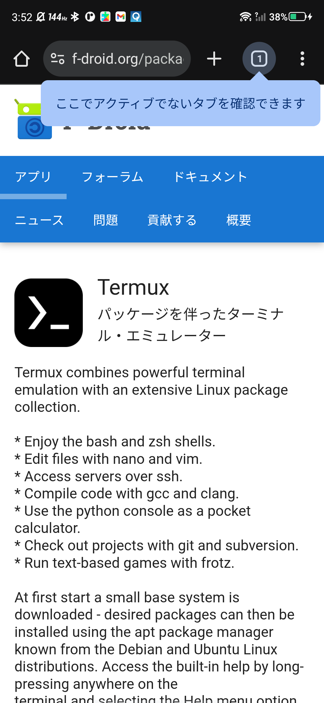
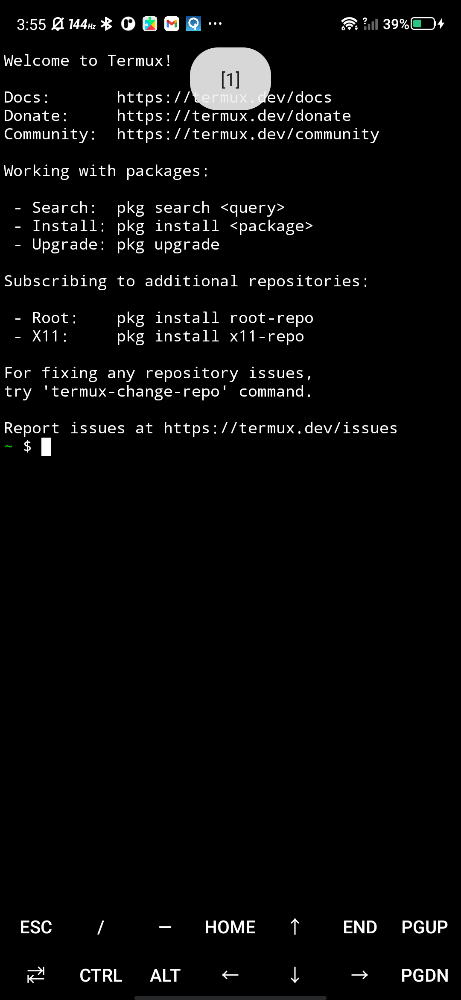
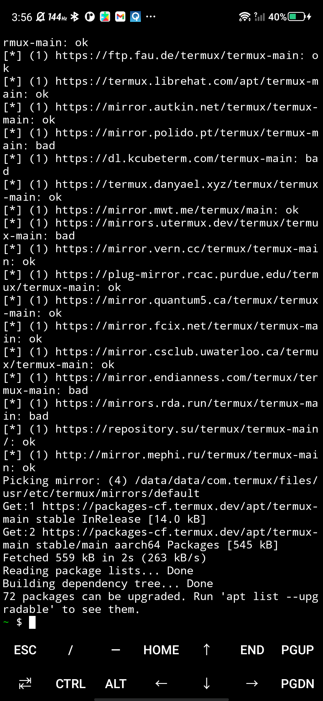
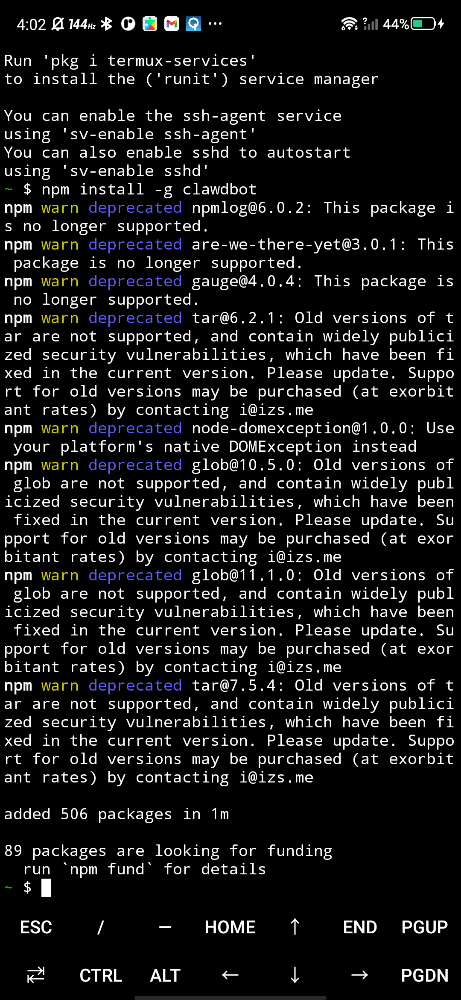
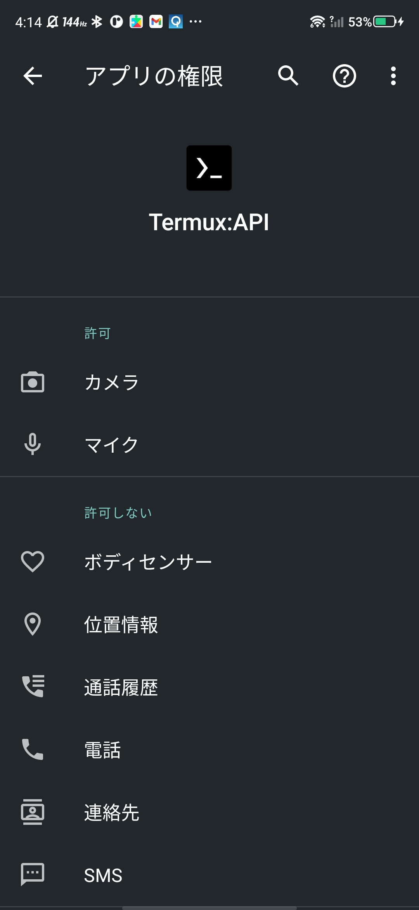
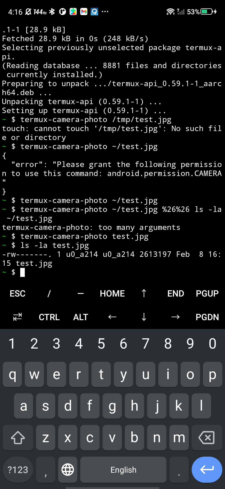

# 【初心者でも簡単！】古いAndroidを使って話題の OpenClaw をセットアップする方法！

## はじめに

最近話題の **OpenClaw**（AIエージェント）を動かしたいけど、VPSは難しそうだし、ミニPCは高騰してるし…そんなあなたに朗報です！

**使っていない古いAndroidスマホ**があれば、それがAIエージェントサーバーに大変身します！しかも**カメラ・マイク付き**で、追加コストほぼゼロ。

この記事では、初心者でも迷わずセットアップできるように、手順を丁寧に解説します。

> 📌 **用語の整理**  
> - **OpenClaw** = オープンソースのAIエージェント基盤の愛称  
> - **Clawdbot** = OpenClawを動かすためのCLI（npmパッケージ名）  
> - コマンドは `clawdbot` を使います

---

## この方法のメリット

✅ **コストゼロ**：古いスマホを再活用  
✅ **カメラ・マイク内蔵**：AIが「目」と「耳」を持てる  
✅ **省電力**：PCよりはるかに電気代が安い  
✅ **ネットワーク分離が簡単**：セキュリティリスクを軽減できる  

---

## ⚠️ セキュリティに関する注意

この方法は手軽ですが、以下の点を理解した上でご利用ください：

- **APIキーを端末に保存する**ため、端末の紛失・盗難時にはキーを無効化する必要があります
- **端末のOSアップデート状況**によっては、セキュリティリスクが残ります
- 本記事の手順は「リスクを軽減する」ものであり、「完全に安全」を保証するものではありません
- 重要なシステムには使用せず、**実験・趣味用途**としてお使いください

---

## 必要なもの

- Android 7.0 以上のスマートフォン（古くてOK！）
- WiFi環境
- LLMプロバイダのAPIキー（Anthropic / OpenAI / Google など、利用するものに応じて）

---

## Step 1: Termuxをインストール

まず、Android上でLinux環境を動かせる **Termux** をインストールします。

⚠️ **重要**: Google Play版は古いので、**F-Droid** からインストールしてください！

1. ブラウザで以下のURLを開く  
   👉 https://f-droid.org/packages/com.termux/

2. 「Download APK」をタップしてインストール

3. インストール時に「提供元不明のアプリ」の許可を求められたら許可する



---

## Step 2: Termuxの初期設定

Termuxを開いて、以下のコマンドを**1行ずつ**実行します。



```bash
# ストレージへのアクセス許可（カメラ画像の保存などに必要）
termux-setup-storage

# パッケージを最新に更新
pkg update && pkg upgrade
```

「Do you want to continue?」と聞かれたら `y` を入力してEnter。



---

## Step 3: 環境を構築する

続けて以下を実行：

```bash
# Node.js と Git をインストール
pkg install nodejs-lts git
```


「Do you want to continue?」と聞かれたら `y` を入力してEnter。

---

## Step 4: OpenClawをインストール

```bash
# Clawdbot（OpenClaw）をインストール
npm install -g clawdbot
```



### ⚠️ Android向けパッチ（重要）

Clawdbotは公式にはAndroidをサポートしていませんが、[DroidClaw](https://github.com/nexty5870/DroidClaw) プロジェクトのパッチを適用することで動作します。

**パッチを適用：**

```bash
# 1. ディレクトリ作成
mkdir -p ~/.clawdbot/tmp

# 2. TMPDIR設定
echo 'export TMPDIR="$HOME/.clawdbot/tmp"' >> ~/.bashrc
export TMPDIR="$HOME/.clawdbot/tmp"

# 3. clipboardスタブ作成
STUB="$PREFIX/lib/node_modules/@mariozechner/clipboard-android-arm64"
mkdir -p "$STUB"
echo '{"name":"@mariozechner/clipboard-android-arm64","version":"0.3.2","main":"index.js"}' > "$STUB/package.json"
echo 'module.exports={getText:async()=>"",setText:async()=>{},hasImage:async()=>false,clear:async()=>{},availableFormats:async()=>[]};' > "$STUB/index.js"

# 4. /tmp パスを置換
find $PREFIX/lib/node_modules/clawdbot/dist -name "*.js" \
  -exec grep -l "/tmp/clawdbot" {} \; | while read f; do
    sed -i "s|/tmp/clawdbot|$HOME/.clawdbot/tmp|g" "$f"
done

# 5. clawラッパー作成
cat > $PREFIX/bin/claw << 'EOF'
#!/data/data/com.termux/files/usr/bin/bash
export TMPDIR="$HOME/.clawdbot/tmp"
exec clawdbot "$@"
EOF
chmod +x $PREFIX/bin/claw
```

> 💡 パッチ適用後は `clawdbot` の代わりに `claw` コマンドを使用してください。

---

## Step 5: 初期設定

```bash
# 作業フォルダを作成して移動
mkdir -p ~/openclaw && cd ~/openclaw

# 初期設定を開始
clawdbot setup
```

設定ファイルが `~/.clawdbot/clawdbot.json` に作成されます。

### APIキーの設定

設定ファイルを編集してAPIキーを追加します：

```bash
nano ~/.clawdbot/clawdbot.json
```

以下のように `apiKey` を追加：

```json
{
  "agent": {
    "model": "anthropic/claude-sonnet-4-20250514",
    "apiKey": "sk-ant-xxxxx（あなたのAPIキー）"
  }
}
```

---

## Step 6: 起動する

```bash
cd ~/openclaw
claw gateway
```

> ⚠️ **注意**: パッチ適用後は `clawdbot` ではなく `claw` コマンドを使用してください。`claw` は適切な環境変数を設定してから `clawdbot` を実行するラッパーです。

これでOpenClawが起動します！🎉

### バックグラウンドで実行したい場合

```bash
# nohupを使ってバックグラウンド実行
nohup claw gateway > ~/.clawdbot/logs/gateway.log 2>&1 &
```

---

## 【オプション】カメラ・マイクを使う

AIエージェントからカメラやマイクにアクセスしたい場合は、**Termux:API** をインストールします。

### 1. Termux:APIアプリをインストール

F-Droidから **Termux:API** をダウンロードしてインストール：
👉 https://f-droid.org/packages/com.termux.api/

### 2. termux-apiパッケージをインストール

Termuxで以下を実行：

```bash
pkg install termux-api
```

### 3. 権限を許可

Androidの設定から、Termux:APIアプリに以下の権限を許可：
- カメラ
- マイク
- 位置情報（必要に応じて）



### 4. 動作確認

```bash
# カメラで撮影
termux-camera-photo test.jpg
ls -la test.jpg

# マイクで録音（3秒）
termux-microphone-record -l 3 -f test.m4a
ls -la test.m4a
```



---

## 【重要】ネットワークを分離してセキュリティリスクを軽減

AIエージェントを運用する際は、**ホームネットワークから分離**することを強くおすすめします。

### 方法1: ゲストネットワークを使う（最も簡単！）

ほとんどの家庭用ルーターには「ゲストWiFi」機能があります。

1. ルーターの管理画面にアクセス（192.168.1.1 など）
2. 「ゲストネットワーク」を有効化
3. Androidをゲストネットワークに接続

これだけで、メインネットワークの機器にアクセスできない**分離環境**が完成！

### 方法2: 古いルーターを使う

使っていない古いルーターがあれば：

1. 古いルーターのWAN側をメインルーターのLANに接続
2. Androidを古いルーターのWiFiに接続

二重NATになりますが、シンプルに分離できます。

### 方法3: モバイル回線を使う

究極の分離方法：

- 古いSIMカードを挿す
- povoなどの格安トッピングを使う

物理的に完全分離された環境になります。

---

## 便利なオプション設定

### Termux:Boot（自動起動）

スマホの再起動時に自動でOpenClawを起動したい場合は **Termux:Boot** をインストール。

👉 https://f-droid.org/packages/com.termux.boot/

インストール後、`~/.termux/boot/` に起動スクリプトを配置：

```bash
mkdir -p ~/.termux/boot
cat > ~/.termux/boot/start-openclaw.sh << 'EOF'
#!/data/data/com.termux/files/usr/bin/bash
cd ~/openclaw
clawdbot gateway >> ~/openclaw/gateway.log 2>&1
EOF
chmod +x ~/.termux/boot/start-openclaw.sh
```

### バッテリー最適化を除外

Androidの設定から、Termuxを「バッテリー最適化の対象外」にしておくと、バックグラウンドで安定動作します。

設定 → アプリ → Termux → バッテリー → 最適化しない

> 💡 **端末メーカーによる注意点**  
> Xiaomi、OPPO、Huaweiなど一部メーカーの端末では、上記に加えて「アプリのロック」「自動起動の許可」「省電力モードからの除外」など、メーカー独自の設定が必要な場合があります。「[メーカー名] アプリ バックグラウンド」で検索してみてください。

---

## トラブルシューティング

### 「Cannot find module '@mariozechner/clipboard-android-arm64'」エラー

Step 4のAndroid向けパッチを適用してください。

### 「Gateway service install not supported on android」エラー

`clawdbot gateway start` ではなく `clawdbot gateway` を使用してください。Androidではデーモン化がサポートされていません。

### カメラ/マイクにアクセスできない

1. Termux:APIアプリがインストールされているか確認
2. termux-apiパッケージがインストールされているか確認（`pkg install termux-api`）
3. Androidの設定でTermux:APIアプリに権限が付与されているか確認

---

## ワンライナーでサクッとセットアップ（上級者向け）

上記の手順を自動化したスクリプトを用意しています。

```bash
curl -sL https://raw.githubusercontent.com/sw11ow240/openclaw-android-guide/main/termux-openclaw-install.sh | bash
```

> 🔒 **セキュリティ上の注意**  
> `curl | bash` 形式のインストールは便利ですが、**必ず事前にスクリプトの中身を確認**してから実行してください。  
> 信頼できないURLからのスクリプト実行は危険です。

---

## まとめ

古いAndroidスマホが、話題のAIエージェント「OpenClaw」のサーバーに生まれ変わりました！

- 💰 追加コストほぼゼロ
- 📱 カメラ・マイク付き
- 🛡️ ネットワーク分離でリスク軽減
- ⚡ 省電力で24時間稼働OK

眠っているスマホを活用して、AIエージェントライフを始めてみませんか？

---

## 関連リンク

- [OpenClaw 公式ドキュメント](https://docs.clawd.bot)
- [DroidClaw](https://github.com/nexty5870/DroidClaw) - Android向けパッチスクリプト
- [Termux (F-Droid)](https://f-droid.org/packages/com.termux/)
- [Termux:API (F-Droid)](https://f-droid.org/packages/com.termux.api/)
- [Termux:Boot (F-Droid)](https://f-droid.org/packages/com.termux.boot/)
- [Anthropic API](https://console.anthropic.com/)
- [OpenAI API](https://platform.openai.com/)

---

*この記事が役に立ったら、ぜひ「スキ」をお願いします！質問はコメント欄へどうぞ。*
